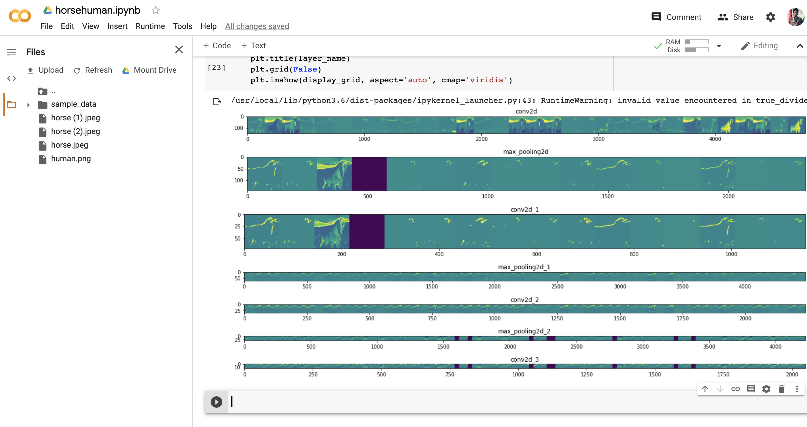
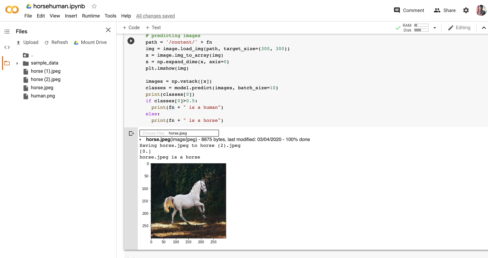

# Horse-vs-Human
A Tensorflow based approach to visualise the various stages of Convolutions in classifying images as humans or horses .

## Visualising the Convolutions at each layer of the Neural Network

## Testing the model with a real world image

